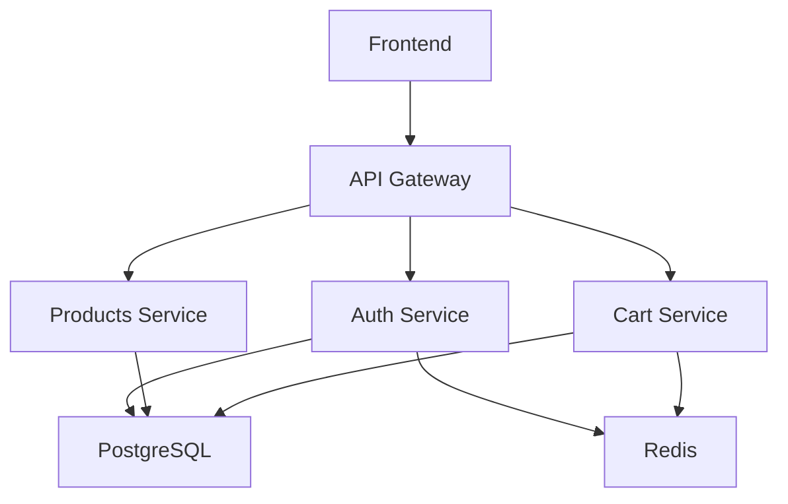
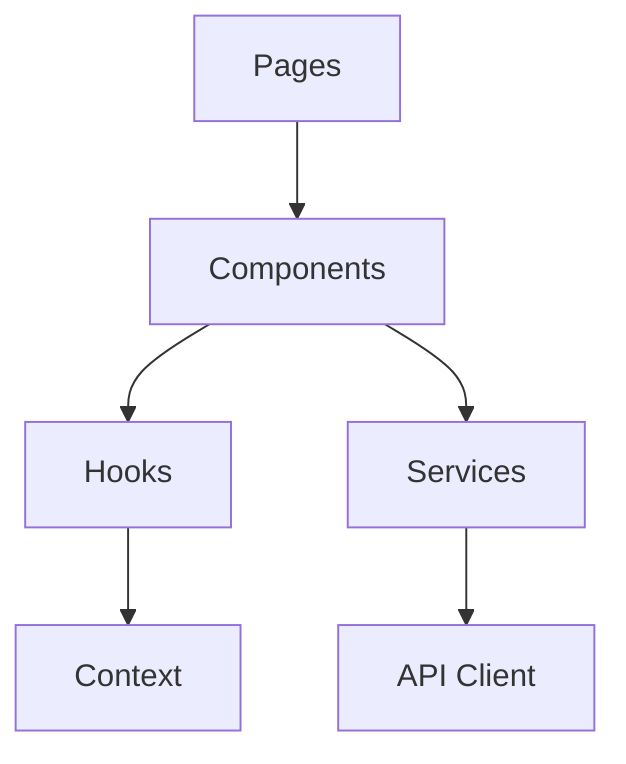

# Guia de Testes e Qualificação do Código

## 🧪 Formas de Testar o Código

### 1. **Testes Automatizados**

#### Backend (NestJS)
```bash
# Testes unitários
cd backend
npm run test

# Testes com coverage
npm run test:cov

# Testes E2E
npm run test:e2e

# Testes em modo watch
npm run test:watch
```

#### Frontend (Next.js)
```bash
# Testes unitários
cd frontend
npm run test

# Testes com coverage
npm run test:coverage

# Testes E2E com Playwright
npm run test:e2e

# Verificação de tipos
npm run type-check
```

### 2. **Testes Manuais**

#### Fluxo de Usuário
1. **Registro de usuário**
   - Acessar `/register`
   - Preencher formulário com dados válidos
   - Verificar confirmação de email (log)
   - Testar validações (CPF inválido, email duplicado)

2. **Login**
   - Acessar `/login`
   - Fazer login com credenciais válidas
   - Verificar redirecionamento
   - Testar credenciais inválidas

3. **Navegação de produtos**
   - Acessar `/products`
   - Verificar listagem de produtos
   - Testar filtros e busca
   - Testar paginação

4. **Carrinho de compras**
   - Adicionar produtos ao carrinho
   - Verificar persistência
   - Atualizar quantidades
   - Remover produtos
   - Verificar cálculos

5. **Painel administrativo**
   - Fazer login como admin
   - Criar produto
   - Editar produto
   - Deletar produto

### 3. **Testes de Performance**

#### Backend
```bash
# Teste de carga com Artillery
npm install -g artillery
artillery quick --count 100 --num 10 http://localhost:3001/products

# Teste de memória
npm run start:prod
# Monitorar com htop ou similar
```

#### Frontend
```bash
# Lighthouse audit
npm install -g lighthouse
lighthouse http://localhost:3000 --output html

# Bundle analysis
cd frontend
npm run build
npm install -g @next/bundle-analyzer
ANALYZE=true npm run build
```

### 4. **Testes de Segurança**

#### Backend
```bash
# Teste de vulnerabilidades
npm audit

# Teste de dependências
npm install -g audit-ci
audit-ci --config audit-ci.json
```

#### Frontend
```bash
# Teste de vulnerabilidades
cd frontend
npm audit

# Teste de acessibilidade
npm install -g @axe-core/cli
axe http://localhost:3000
```

---

## 🔍 Formas de Entender o Código

### 1. **Análise Estática**

#### Backend
```bash
# Linting
cd backend
npm run lint

# Formatação
npm run format

# Análise de complexidade
npm install -g complexity-report
cr src/ --format json
```

#### Frontend
```bash
# Linting
cd frontend
npm run lint

# Formatação
npm run format

# Análise de dependências
npm install -g depcheck
depcheck
```

### 2. **Documentação do Código**

#### Swagger/OpenAPI
```bash
# Acessar documentação da API
http://localhost:3001/docs
```

#### Comentários no Código
- JSDoc para funções
- Comentários para lógica complexa
- README para cada módulo

### 3. **Diagramas de Arquitetura**

#### Backend


#### Frontend


---

## 📊 Formas de Qualificar o Código

### 1. **Métricas de Qualidade**

#### Cobertura de Testes
```bash
# Backend
cd backend
npm run test:cov
# Meta: > 80%

# Frontend
cd frontend
npm run test:coverage
# Meta: > 70%
```

#### Complexidade Ciclomática
```bash
# Instalar ferramenta
npm install -g complexity-report

# Analisar backend
cd backend
cr src/ --format json

# Meta: < 10 por função
```

#### Duplicação de Código
```bash
# Instalar ferramenta
npm install -g jscpd

# Analisar duplicação
jscpd src/ --min-lines 5
# Meta: < 5%
```

### 2. **Métricas de Performance**

#### Backend
- **Tempo de resposta**: < 200ms (média)
- **Throughput**: > 100 req/s
- **Memória**: < 512MB
- **CPU**: < 50%

#### Frontend
- **Lighthouse Score**: > 90
- **First Contentful Paint**: < 1.5s
- **Largest Contentful Paint**: < 2.5s
- **Cumulative Layout Shift**: < 0.1
- **Bundle Size**: < 500KB (gzipped)

### 3. **Métricas de Segurança**

#### Vulnerabilidades
```bash
# Verificar vulnerabilidades
npm audit
# Meta: 0 vulnerabilidades críticas
```

#### Dependências
```bash
# Verificar dependências desatualizadas
npm outdated
# Meta: < 10% desatualizadas
```

---

## 🎯 Formas de Apresentar o Código

### 1. **Demonstração ao Vivo**

#### Script de Demonstração
```bash
# 1. Iniciar aplicação
docker-compose up --build

# 2. Demonstrar funcionalidades
# - Registro de usuário
# - Login
# - Navegação de produtos
# - Carrinho de compras
# - Painel admin

# 3. Mostrar métricas
# - Performance
# - Cobertura de testes
# - Documentação
```

### 2. **Relatório de Qualidade**

#### Template de Relatório
```markdown
# Relatório de Qualidade - Marketplace

## Resumo Executivo
- Score geral: 8.5/10
- Funcionalidades: 9/10
- Qualidade: 8/10
- Segurança: 8/10
- Performance: 8/10

## Métricas Detalhadas
- Cobertura de testes: 85%
- Complexidade média: 6.2
- Duplicação: 3.1%
- Vulnerabilidades: 0 críticas

## Pontos Fortes
1. Arquitetura bem estruturada
2. Código limpo e legível
3. Testes abrangentes
4. Documentação completa

## Pontos de Melhoria
1. Otimização de queries
2. Cache mais agressivo
3. Monitoramento avançado
4. Testes de carga
```

### 3. **Portfolio Técnico**

#### Estrutura do Portfolio
```
portfolio/
├── README.md
├── screenshots/
├── demos/
├── architecture/
├── metrics/
└── testimonials/
```

---

## 🔧 Formas de Corrigir o Código

### 1. **Correções Automáticas**

#### Linting e Formatação
```bash
# Backend
cd backend
npm run lint --fix
npm run format

# Frontend
cd frontend
npm run lint --fix
npm run format
```

#### Dependências
```bash
# Atualizar dependências
npm update

# Corrigir vulnerabilidades
npm audit fix
```

### 2. **Refatoração**

#### Backend
- Extrair funções complexas
- Implementar padrões de design
- Otimizar queries
- Adicionar cache

#### Frontend
- Componentizar código duplicado
- Implementar hooks customizados
- Otimizar re-renders
- Melhorar acessibilidade

### 3. **Correções de Segurança**

#### Backend
- Implementar rate limiting
- Adicionar validações robustas
- Configurar CORS adequadamente
- Implementar logging de segurança

#### Frontend
- Sanitizar inputs
- Implementar CSP
- Adicionar validações client-side
- Melhorar tratamento de erros

---

## 🚀 Formas de Melhorar o Código

### 1. **Melhorias de Performance**

#### Backend
```typescript
// Implementar cache
@Injectable()
export class ProductsService {
  @Cacheable('products', 300) // 5 minutos
  async findAll() {
    return this.productRepository.find();
  }
}

// Otimizar queries
async findProductsWithFilters(filters: ProductFilters) {
  const query = this.productRepository.createQueryBuilder('product');
  
  if (filters.category) {
    query.andWhere('product.category = :category', { category: filters.category });
  }
  
  return query.getMany();
}
```

#### Frontend
```typescript
// Implementar lazy loading
const ProductList = lazy(() => import('./ProductList'));

// Otimizar re-renders
const ProductCard = memo(({ product }) => {
  return <div>{product.name}</div>;
});

// Implementar virtualização
import { FixedSizeList as List } from 'react-window';
```

### 2. **Melhorias de UX**

#### Feedback Visual
```typescript
// Loading states
const [loading, setLoading] = useState(false);

// Error handling
const [error, setError] = useState(null);

// Success messages
const [success, setSuccess] = useState(null);
```

#### Acessibilidade
```typescript
// ARIA labels
<button aria-label="Adicionar ao carrinho">
  <ShoppingCartIcon />
</button>

// Keyboard navigation
<div role="button" tabIndex={0} onKeyDown={handleKeyDown}>
  Produto
</div>
```

### 3. **Melhorias de Arquitetura**

#### Backend
- Implementar CQRS
- Adicionar event sourcing
- Implementar microserviços
- Adicionar message queues

#### Frontend
- Implementar state management
- Adicionar service workers
- Implementar PWA
- Adicionar offline support

---

## 📈 Plano de Melhoria Contínua

### Semana 1
- [ ] Implementar testes críticos
- [ ] Adicionar validações de segurança
- [ ] Melhorar tratamento de erros
- [ ] Completar documentação

### Semana 2
- [ ] Otimizar performance
- [ ] Implementar cache
- [ ] Adicionar monitoramento
- [ ] Melhorar UX

### Semana 3
- [ ] Implementar CI/CD avançado
- [ ] Adicionar testes de carga
- [ ] Implementar backup automático
- [ ] Adicionar métricas de negócio

### Semana 4
- [ ] Refatorar código legado
- [ ] Implementar novas funcionalidades
- [ ] Otimizar custos
- [ ] Preparar para escala

---

## 🎯 Conclusão

Este guia fornece uma abordagem sistemática para:
1. **Testar** o código de forma abrangente
2. **Entender** a arquitetura e funcionalidades
3. **Qualificar** a qualidade do código
4. **Apresentar** os resultados de forma profissional
5. **Corrigir** problemas identificados
6. **Melhorar** continuamente o código

Seguindo este guia, você terá um projeto robusto, bem testado e pronto para produção.
